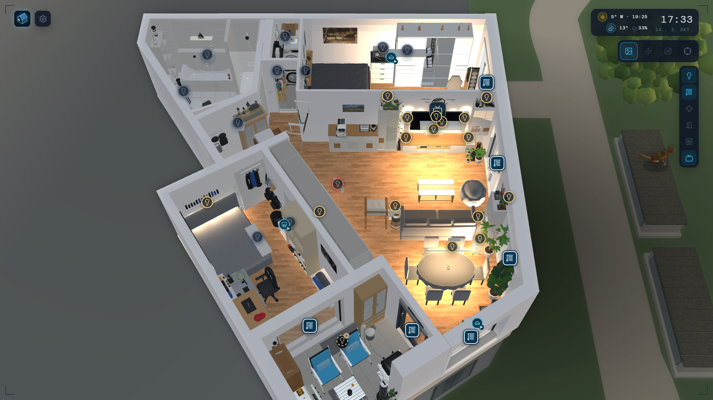
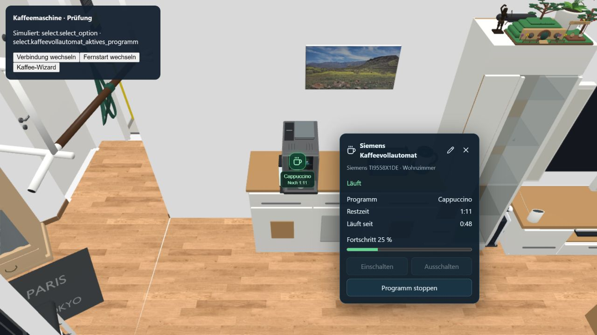

# HomeTwin3D

**Dein Zuhause als interaktives 3D-Dashboard für Home Assistant.**

HomeTwin3D verbindet einen eigenen 3D-Grundriss mit den Geräten und Zuständen deines Smart Homes. Du kannst durch die Wohnung gehen, Leuchten und Rollos direkt am Modell bedienen und Türkontakte, Haushaltsgeräte sowie Medieninformationen an ihrem räumlichen Platz sehen. Es läuft als **Home-Assistant-Add-on**; das 3D-Board selbst läuft im Browser – auf aktuellen iPads und Samsung-Tablets ebenso wie auf Windows-PCs – und eignet sich als Wand-Dashboard.

**Ausprobieren ohne Einrichtung:** `…/?daydemo` spielt einen simulierten Tag im Zeitraffer – vom Lichtwecker über Kaffee, Gewitter und Kochen bis zum Videoabend mit Hue-Sync-Licht und dem Energiefluss der Woche. **Eigenes Zuhause:** Wohnung in Blender modellieren, mit der mitgelieferten Erweiterung exportieren, im Assistenten verbinden und zuordnen – Schritt für Schritt in [Erste Schritte](docs/GETTING_STARTED.md).

Das Projekt wird von **Raza55** unabhängig weiterentwickelt. Es entstand aus [3Dash von Kdcius und seinen Mitwirkenden](https://github.com/Kdcius/3Dash_webapp). Die Apache-2.0-Lizenz und die ursprünglichen Autorenhinweise bleiben erhalten. Dieses Repository beginnt aus Datenschutzgründen mit einem bereinigten Quelltext-Snapshot ohne die frühere Git-Historie. Einzelheiten: [Herkunft und Danksagung](ORIGIN.md).

> **Hinweis:** HomeTwin3D ist aus einer konkreten Wohnung heraus entstanden. Einige Funktionen (Hue-Sync-Anzeige, Wasserleck, TV-Medien, TV Dial) verwenden Beispiel-Entities, die man auf die eigenen umlenkt, und die Außenumgebung ist eine Beispielumgebung. Was das bedeutet, steht unter [Funktionen, Grenzen und Technik](PROJECT_STATUS.md). Die aktuelle Version zeigt der [Änderungsverlauf](CHANGELOG.md).

> **Wichtig für Tablets: HomeTwin3D über HTTPS öffnen.** Das Add-on liefert die Oberfläche zunächst über unverschlüsseltes HTTP (Port 8099). Auf Tablets, zum Beispiel einem iPad mit Safari, läuft die 3D-Ansicht so deutlich langsamer und ruckelt, denn Safari rendert unsichere Seiten erheblich langsamer. Für ein flüssiges Wand-Dashboard deshalb einen Reverse Proxy mit Zertifikat vorschalten (etwa Nginx Proxy Manager), der auf `http://<ha-ip>:8099` zeigt und **WebSockets weiterleitet**, und das Board immer über die `https://` Adresse öffnen. Die App verbindet sich dann automatisch sicher mit Home Assistant. Anleitung: [HTTPS einrichten](3dash-addon/DOCS.md#https-verbindung-und-bilder). Die Bildrate lässt sich mit `?perf` an der Adresse prüfen.

## Was HomeTwin3D kann

- **Dein eigener Grundriss:** GLB-Modelle importieren und zur Laufzeit austauschen, Räume bearbeiten, zusätzliche Objekte platzieren und Modellteile verschieben, drehen oder skalieren.
- **Blender als Arbeitsgrundlage:** Export mit stabilen Gerätekennungen, Lichtquellen und Animationen. Ein visueller Assistent verbindet Modellobjekte mit Home-Assistant-Entities; Zuordnungen bleiben bei passenden Reimporten erhalten.
- **Licht direkt im Raum:** Schalten, Dimmen, Farbe und Farbtemperatur, einzelne und gruppierte Leuchten, kalibrierbare Lichtwirkung und Hue-Sync-Statusanzeige.
- **Rollos und Öffnungen:** Rollo-Positionen und Raumaktionen, animierte Tür-/Fensterkontakte, Öffnungsdauer und getrennte Anzeige des Haustürschlosses.
- **Begehbare Wohnung:** Orbit-, Walk- und Flugmodus mit lokal bedienbaren Innentüren.
- **Neue Gerätebedienung:** Lüfter mit Prozentsteuerung, Echo-Mediengeräte, Kaffeeprogramm mit explizitem Start/Stopp sowie PC-/Serverstatus mit konfigurierbaren Aktionen.
- **Warnungen am richtigen Ort:** Wasserleckmarker und gerätebezogene Batteriewarnungen.
- **Geräte und Medien:** Waschmaschinen-/Trockneranimationen, Programm-/Restzeitsensoren und TV-Anzeigen mit Quellenwahl, SHIELD-Metadaten, Fortschritt sowie optionalen ADB-Screenshots.
- **Lebendige Umgebung:** Sonnenstand, Tag/Nacht, Wettereffekte, Spiegel und eine prozedurale Außenumgebung – optional mit einer Hofkatze und Vögeln, die auf Wetter und Tageszeit reagieren.
- **Energiefluss:** Die Verbraucher aus dem HA-Energie-Dashboard als leuchtende Linien und Kugeln am Modell, mit Anteilen pro Raum, Live-Leistung und Verbrauch von heute bis zum Jahr; Lampen ohne Messung über PowerCalc.
- **Übersichtlich bleiben:** Markierungsfilter nach Licht, Rollos, Lüftung, Türen & Fenster, Geräten und Medien.
- **Tagesdemo und Benchmark:** Ein vollständiger Tag mit Kamerafahrten, Bedienung per Fingertipp auf die eigenen Popups und einer Leistungsmessung am Ende – auch mit dem eigenen Modell.
- **Anpassbares Dashboard:** Status-, Skript- und Diagrammkarten, deutsche/englische Oberfläche, Themes, Demo-Modus, gemeinsame Version für alle Geräte und installierbare PWA.

Die Darstellung verwendet Echtzeit-Näherungen. TV-Screenshots sind kein HDMI-Livestream; Tür-Kippstellungen können als Annahme dargestellt werden. Details und Grenzen stehen in [Funktionen, Grenzen und Technik](PROJECT_STATUS.md).

## Beispielbilder

Aufnahmen aus den Testsimulationen mit simulierten Zuständen. Sie zeigen die Referenzwohnung des Projekts, die nicht im Repository enthalten ist. Keine echten Desktop-Screenshots. [Bildnachweise und zugehörige Prüfseiten](docs/images/README.md).

**Gesamter Plan am Abend: Lampen- und Rollo-Markierungen, Filterleiste rechts, Werkzeugleiste und Wetter oben**



**Kaffeeprogramm mit Status, Restzeit und Stopp-Aktion**




## Schnellstart

Voraussetzung: **Node.js 22.18 oder neuer** und npm.

```bash
git clone https://github.com/Raza55/HomeTwin3D.git
cd HomeTwin3D
npm ci
npm run dev
```

Öffne **http://127.0.0.1:5187/HomeTwin3D/**. Der Entwicklungsserver verwendet fest Port 5187 und weicht bei einem belegten Port nicht automatisch aus. Modell und Gerätezuordnungen werden pro Browser und Adresse gespeichert: Ein anderer Port oder `localhost` statt `127.0.0.1` verwendet einen separaten Datenbestand. Starte bei einer neuen Installation mit dem Demo-Modus oder verbinde im Einrichtungsassistenten deine Home-Assistant-Instanz und importiere ein eigenes GLB.

Das Repository enthält ein Simulationsmodell, aber keine echte Wohnung. Wie man das eigene Modell erstellt, beschreibt [Eigenes Modell mit Blender einbinden](BLENDER_WORKFLOW.md). Die versionierten Skripte unter `tools/` (z. B. `bedroom-v106.*`) gehören zur Referenzwohnung und dienen nur als Vorlagen.

## Selbst hosten

```bash
npm run build                  # dist/, für /HomeTwin3D/
npm run build -- --mode addon  # dist/, mit relativen Asset-Pfaden
npm run preview                # zuletzt gebauten Stand ansehen
```

Stelle `dist/` mit einem statischen Webserver bereit. Beide Build-Varianten schreiben in dasselbe Verzeichnis. Für Live-Funktionen muss Home Assistant vom Browser erreichbar sein; bei HTTPS ist eine passende sichere WebSocket-Verbindung erforderlich.

### Home-Assistant-Add-on

Füge `https://github.com/Raza55/HomeTwin3D` unter **Einstellungen → Add-ons → Add-on Store → Repositories** hinzu. Das Repository liefert ein eigenes Add-on **HomeTwin3D** mit der Kennung `hometwin3d`. Der Dockerfile baut den `main`-Branch dieses Projekts.

Die Oberfläche verwendet standardmäßig Port **8099**. Falls das bisherige 3Dash-Add-on parallel läuft, benötigt eines der Add-ons einen anderen Host-Port. Ein bestehendes 3Dash-Add-on wird nicht automatisch ersetzt. Anleitung: [Add-on-Dokumentation](3dash-addon/DOCS.md).

**Für Tablets HTTPS einrichten:** Ohne HTTPS ist die Darstellung auf iPads und anderen Tablets spürbar langsamer. Reverse Proxy mit Zertifikat und WebSocket-Unterstützung auf Port 8099 richten und das Board über `https://` öffnen, siehe [HTTPS einrichten](3dash-addon/DOCS.md#https-verbindung-und-bilder).

Ein Repository-Push installiert kein Add-on-Update. Der Docker-/Supervisor-Betrieb muss auf der Zielinstallation separat geprüft werden.

### TV-Bilder und GitHub Pages

Der Add-on-Nginx enthält einen HA-Medienproxy. Für lokale Entwicklung lässt sich dessen Ziel über `HA_MEDIA_PROXY_TARGET` in `.env.local` konfigurieren. Standard ist `http://homeassistant.local:8123`; siehe [TV und Medien](PROJECT_STATUS.md#tv-und-medien).

Ein GitHub-Pages-Workflow liegt bei, wird aber erst manuell über **Actions → Deploy to GitHub Pages** ausgeführt. Zuvor muss Pages im Repository für GitHub Actions eingerichtet sein. Es wird keine bereits veröffentlichte Demo vorausgesetzt.

## Datenschutz bei Veröffentlichungen

Öffentliche Beispiele enthalten neutrale Gerätekennungen; persönliche Defaults bleiben in einer ignorierten lokalen Konfiguration. Vor jedem Push gilt die [Veröffentlichungsprüfung](docs/PUBLICATION_PRIVACY.md). In einem neuen Clone einmal `npm run privacy:install` ausführen. Normale Produktionsbuilds enthalten keine privaten lokalen Defaults.

## Daten und Sicherung

Einstellungen und Gerätezuordnungen liegen in `localStorage`, Modelle und Objektdateien in `IndexedDB`. Diese Daten gehören zum jeweiligen Browser und zur jeweiligen Origin. Vor einem Wechsel von Host, Port oder Browser die Konfiguration als ZIP und bei Bedarf die Gerätezuordnungen separat exportieren.

Git enthält den App-Quellcode, keine persönliche HA-Konfiguration und keine lokalen Wohnungsdateien. Bestehende Speicher- und Blender-Manifestkennungen bleiben aus Kompatibilitätsgründen erhalten; nicht jede interne Bezeichnung wurde umbenannt.

## Entwicklung und Prüfungen

```bash
npm run privacy:check
npm run test:privacy
npm run typecheck
npm run test:floorplan
npm run test:media
npm run test:balcony
npm run test:echo
npm run test:coffee
npm run test:it
npm run test:battery
npm run test:tv-dial
npm run test:lighting
npm run test:performance
npm run test:walkthrough
npm run test:shared
npm run test:daydemo
npm run test:energy
npm run build
npm run build -- --mode addon
```

Der CI-Workflow führt diese Prüfungen sowie die Python-Tests des optionalen Screenshot-Helfers bei Änderungen auf `main` und bei Pull Requests aus. Die Tests laufen mit synthetischen Daten und benötigen keine echte HA-Installation. Zusätzlich gibt es visuelle Testseiten unter `tools/*-qa.html`, die Zustände simulieren, ohne Geräte zu schalten.

Technik: **React 18 · TypeScript · Babylon.js 9.28 · Vite 6 · Home Assistant WebSocket API**.

| Verzeichnis | Inhalt |
| --- | --- |
| `src/babylon/` | Szene, Licht, Animationen, Navigation, Umgebung |
| `src/components/`, `src/pages/` | Bedienoberfläche, Dashboard, Editor und Onboarding |
| `src/services/` | HA-Verbindung, Import, Zuordnungen, Speicherung und Medien |
| `tools/` | Tests, QA-Seiten und Blender-/GLB-Werkzeuge |
| `public/` | Simulationsmodell, Schriften, Icons und PWA-Manifeste |
| `3dash-addon/` | HomeTwin3D-Add-on; historischer Verzeichnisname |

## Dokumentation

Für Nutzer:

- [Erste Schritte: Installation, Demo, eigenes Blender-Modell, Zuordnen und Anpassen](docs/GETTING_STARTED.md)
- [Eigenes Modell mit Blender einbinden (auch mit KI-Agenten)](BLENDER_WORKFLOW.md)
- [Add-on: Installation, gemeinsame Version, HTTPS](3dash-addon/DOCS.md)
- [Geräte, Warnungen, TV Dial und PC-Bilder](docs/DEVICES_AND_ALERTS.md)
- [Energiefluss, Tagesdemo, Tiere draußen und Markierungsfilter](docs/ENERGY_DEMO_WILDLIFE.md)
- [Funktionen, Grenzen und Technik](PROJECT_STATUS.md)
- [TV Dial einrichten](tools/tv-dial-integration.md) · [Windows-/MQTT-Screenshot-Helfer](tools/pc-screen/README.md)
- [Änderungsverlauf](CHANGELOG.md)

Für Mitwirkende:

- [Hinweise für Mitwirkende und Agenten](docs/AGENT_HANDOFF.md)
- [Fortgeschritten: optimiertes Modell schrittweise ändern](docs/MODEL_PIPELINE.md)
- [Veröffentlichungsregeln](docs/PUBLICATION_PRIVACY.md)
- [Herkunft, Ausgangscommits und Weiterentwicklung](ORIGIN.md)
- [Historische Erweiterungen des früheren Forks](FORK_CHANGES.md) · [English](FORK_CHANGES.en.md)

Fehlerberichte und Vorschläge: [HomeTwin3D Issues](https://github.com/Raza55/HomeTwin3D/issues).

## KI-Unterstützung

Bei der Weiterentwicklung von HomeTwin3D wurde OpenAI Codex mit GPT-Modellen für Code, Dokumentation und Testarbeiten eingesetzt. Die Projektverantwortung liegt bei Raza55. Die Erwähnung bedeutet keine offizielle Beteiligung oder Unterstützung durch OpenAI.

## Lizenz und Herkunft

HomeTwin3D wird unter der **[Apache License 2.0](LICENSE)** veröffentlicht. Die ursprüngliche Arbeit von Kdcius und den 3Dash-Mitwirkenden bildet die Grundlage. HomeTwin3D ist eine eigenständig gepflegte Weiterentwicklung und wird nicht als offizielles Projekt des ursprünglichen Autors dargestellt. Siehe auch [NOTICE](NOTICE) und [ORIGIN.md](ORIGIN.md).
